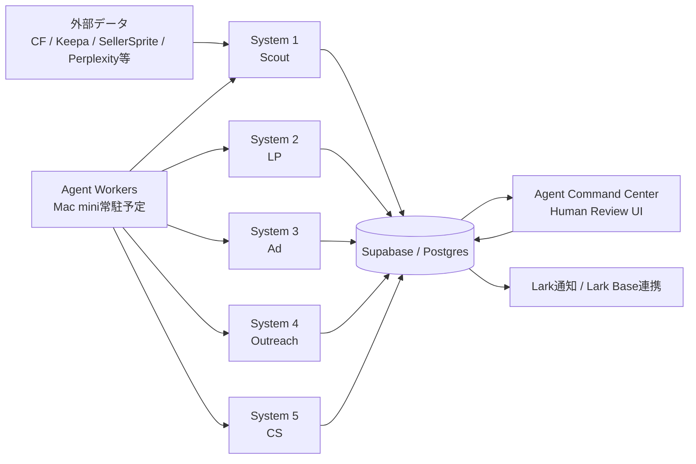
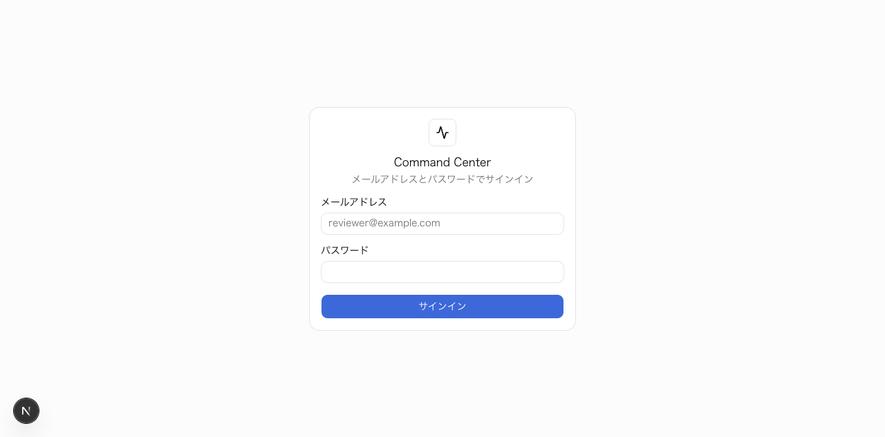
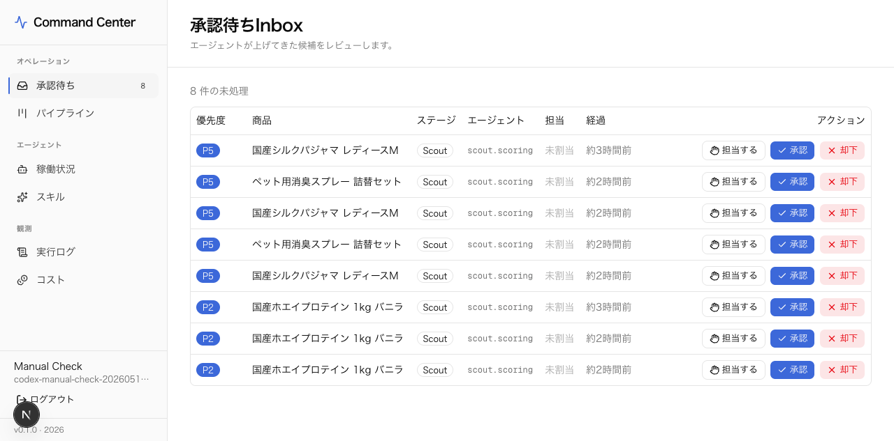
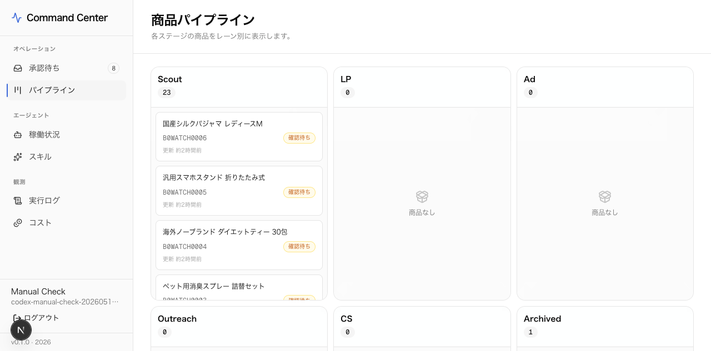
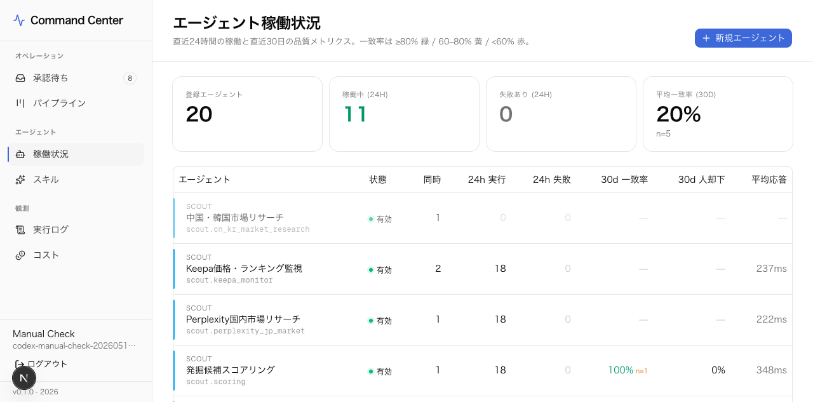
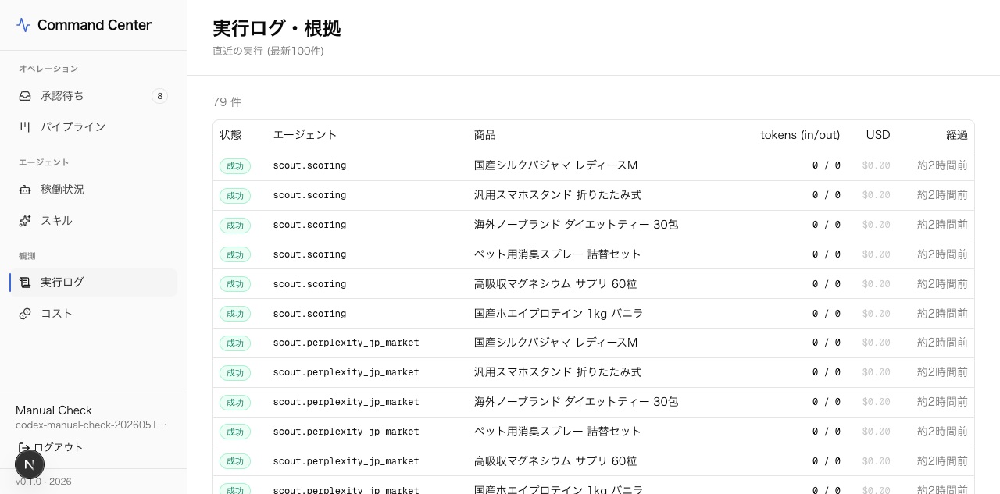
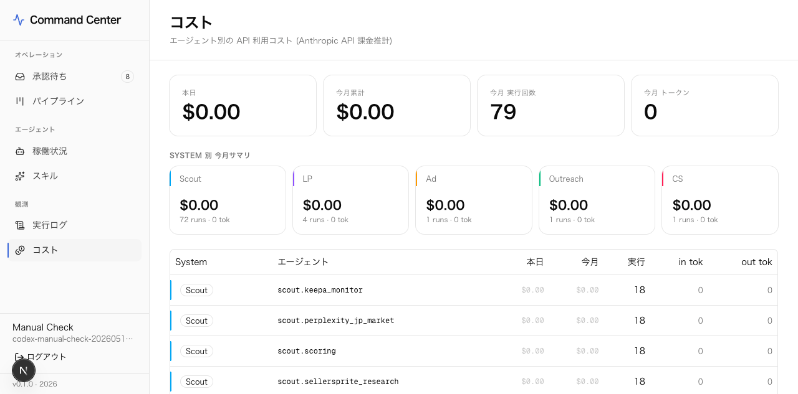

# FASRings エージェントシステム / フロント説明資料

作成日: 2026-05-09  
対象: `agent-command-center` と、周辺の System 1〜6 仕様・scaffold  
前提: Mac mini は 2026-05-10 到着予定。現時点ではローカル開発環境で検証中。

## 1. この資料の目的

この資料は、FASRings案件で構築中の複数AIエージェント運用基盤と、Claude Code で構築中のフロントエンド `Agent Command Center` の現状を説明するためのものです。

主に以下を整理します。

- System 1〜6 がそれぞれ何を担当するか
- AIエージェントの出力を人間がどこで確認・承認するか
- 現在の Next.js フロントがどの画面を持っているか
- Mac mini 到着後に24/7運用へ持っていく時の確認点
- 実際のフロントUIスクリーンショット

スクリーンショットは、実際の Next.js フロントコードを起動し、撮影用のローカルPostgresにサンプルデータを入れて取得しています。既存のSupabase本番/開発テーブルには撮影用データを投入していません。

## 2. 全体像

FASRings案件は、海外クラウドファンディング商品や関連データを発掘し、日本市場向けのLP、広告、メーカー連絡、CS返信までをAIで下書きし、人間が最終判断する運用を目指しています。

AIの役割は「調査・生成・一次判定」、人間の役割は「採否判断・公開判断・送信判断・例外対応」です。`Agent Command Center` は、この人間判断の入り口を1つに集約する管理画面です。



## 3. System 1〜6 の役割

| System | 名称 | 役割 | 現状 |
|---|---|---|---|
| 1 | Scout Engine | 候補商品の収集、国内外リサーチ、一次スコアリング | scaffold / 仕様あり |
| 2 | LP Draft Generator | Makuake等に使うLPコピー、FAQ、構成案の生成 | scaffold / 仕様あり |
| 3 | Ad Creative Engine | 広告見出し、説明文、ターゲット案、素材案の生成 | scaffold / 仕様あり |
| 4 | Outreach Tool | 海外メーカー・仕入先への連絡文面、フォローアップ案 | scaffold / 仕様あり |
| 5 | CS Template Generator | 問い合わせ分類、返信テンプレ、エスカレーション検知 | scaffold / 仕様あり |
| 6 | Review Dashboard | System 1〜5 の人間判断・稼働監視を集約 | 現在は Next.js の `Agent Command Center` として構築中 |

既存仕様では System 6 は FastAPI + Jinja2 + HTMX のダッシュボード案でしたが、現在の `agent-command-center` は Next.js 16 App Router の管理UIとして作られています。役割は同じく「人間レビュー導線の集約」です。

## 4. Agent Command Center の技術スタック

| 項目 | 採用 |
|---|---|
| フレームワーク | Next.js 16 App Router |
| UI | React 19 / TypeScript / Tailwind CSS v4 / shadcn/ui |
| 認証 | Supabase Auth |
| DB | Supabase Postgres / Drizzle ORM |
| DBスキーマ管理 | Drizzle migrations |
| アイコン | lucide-react |
| 通知UI | sonner |

主要ディレクトリ:

| パス | 内容 |
|---|---|
| `src/app/(app)/inbox` | 承認待ちレビュー画面 |
| `src/app/(app)/pipeline` | 商品ステージのカンバン表示 |
| `src/app/(app)/agents` | 登録エージェントと24h実行状況 |
| `src/app/(app)/runs` | 実行ログ、tokens、コスト、失敗理由 |
| `src/app/(app)/cost` | エージェント別APIコスト |
| `src/lib/db/schema` | `products` / `agents` / `agent_runs` / `approval_queue` などのスキーマ |
| `scripts/seed.ts` | 初期エージェント17件の投入 |

## 5. 現在の画面

### 5.1 ログイン

Supabase Auth のメールアドレス・パスワード認証でログインします。



### 5.2 承認待ちInbox

AIエージェントが上げてきた候補や生成物を、人間が承認・却下します。`assigned_to` / `claimed_at` により、レビュー担当の取り合いを避ける設計です。



主な機能:

- 優先度順のレビューキュー
- 商品、ステージ、担当エージェントの表示
- `担当する` によるクレーム
- 承認 / 却下の意思決定
- Supabase Realtime によるキュー更新反映

### 5.3 商品パイプライン

商品を `Scout` / `LP` / `Ad` / `Outreach` / `CS` / `Archived` のステージ別に表示します。



この画面は、商品が今どの工程にいるかを把握するための一覧です。今後は、各カードから商品詳細、スコア根拠、LP/広告案のレビューへ遷移する導線を追加できます。

### 5.4 エージェント稼働状況

登録済みエージェントの一覧、System番号、同時実行数、過去24時間の実行数・失敗数を表示します。



現在の seed では 17 agents が登録されます。

- Scout: 4 agents
- LP: 4 agents
- Ad: 3 agents
- Outreach: 3 agents
- CS: 3 agents

### 5.5 実行ログ・根拠

直近100件の `agent_runs` を表示します。tokens、USDコスト、実行状態、対象商品を追えるため、後から「なぜこの判断になったか」を辿る基礎になります。



### 5.6 コスト

`agent_runs.cost_usd` を元に、本日・今月累計・今月実行回数を集計します。



今後、Anthropic / Apify / Perplexity / Keepa / Make.com など provider 別のコストイベントに分解すると、実運用コストの見積もり精度が上がります。

## 6. DBモデルの考え方

| テーブル | 役割 |
|---|---|
| `products` | パイプラインの中心。商品、ステージ、ステータス、metadataを保持 |
| `agents` | エージェント定義。ID、System番号、実行上限、予算など |
| `agent_runs` | 1実行1行。status、input/output、tokens、cost、errorを保存 |
| `agent_evaluations` | 自動評価または人間評価の verdict と根拠 |
| `approval_queue` | 人間レビュー待ちキュー。排他制御と承認/却下を管理 |
| `cost_ledger` | 日次コスト集計用。現状は `agent_runs` からも導出可能 |

運用上の重要点は、AIの出力そのものではなく、AI出力に対して人間がどう判断したかをDBに残すことです。これにより、あとからプロンプト改善、モデル切替、コスト最適化、判断基準の見直しができます。

## 7. Mac mini 到着後の運用イメージ

Mac mini 到着予定日は 2026-05-10 です。到着後は、まず「開発機」ではなく「常時稼働する小さな運用サーバー」としてセットアップするのがよいです。

推奨する常駐構成:

| 役割 | 推奨 |
|---|---|
| フロントUI | `pnpm build` 後、`pnpm start` を `pm2` または `launchd` で常駐 |
| エージェントワーカー | 別プロセスとして常駐。将来的には BullMQ + Redis など |
| DB | 当面は Supabase Postgres。ローカルPostgresは撮影・検証・バックアップ用途 |
| 通知 | Lark通知を優先。重要アラートはメール/Slack併用も検討 |
| ログ | `agent_runs` + process logs。障害時に追えることを優先 |
| 秘密情報 | `.env.local` ではなく、1Password等で原本管理 |

初期セットアップ手順の目安:

```bash
pnpm install
pnpm db:push
pnpm db:apply-rls
pnpm db:seed
pnpm build
pnpm start
```

常駐化の例:

```bash
pm2 start "pnpm start" --name agent-command-center
pm2 save
```

## 8. 現時点の確認メモ

2026-05-09 の確認では、Next.js フロント自体は起動し、ログイン画面と各内部画面のレンダリングは確認できています。

一方で、現在の `.env.local` のSupabase DB接続文字列は再確認が必要です。

- Direct DB host はこの環境から名前解決できませんでした。
- Pooler 接続は tenant / user 不一致らしきエラーになりました。
- Supabase Auth のAPIドメイン自体は到達可能でした。

Mac mini セットアップ時には、Supabase Dashboard から最新の接続文字列を取り直し、`DATABASE_URL` と `DATABASE_POOL_URL` を更新してください。特に Supabase pooler はユーザー名・リージョン・ポートが変わりやすいので、Dashboard 表示を真実とします。

## 9. 直近の次アクション

1. Mac mini 到着後、Node / pnpm / Git / Postgres / pm2 を導入する。
2. Supabase のDB接続文字列を取り直して `.env.local` を更新する。
3. `pnpm db:push`、`pnpm db:apply-rls`、`pnpm db:seed` を通す。
4. `pnpm build` と `pnpm start` を確認する。
5. `Agent Command Center` に実データを流し、Inbox → 承認/却下 → runs/cost の導線を検証する。
6. エージェントワーカー実行基盤を別プロセスとして設計する。
7. Lark Base / Make.com / 国内リサーチ / provider別コスト管理を追加要件として整理する。

## 10. 関連資料

- [Agent Command Center README](../README.md)
- [仕様書インデックス](../../00_仕様書/README.md)
- [最新事業プラン照合メモ](../../00_仕様書/latest_plan_alignment_2026-05-09.md)
- [System 06 Review Dashboard 仕様](../../00_仕様書/system06_review_dashboard.md)
